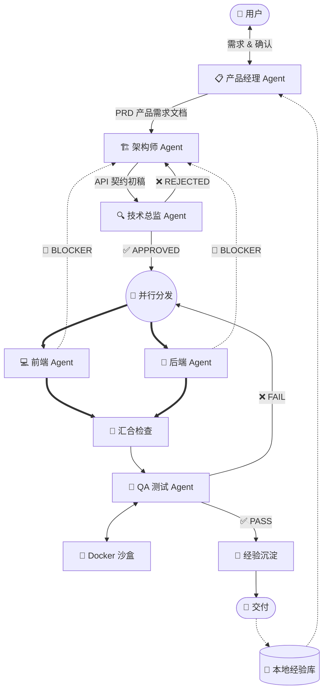

# 🚀 LangGraph Multi-Agent State Machine

[English](#english) | [中文](#中文)

---

<a name="中文"></a>
## 中文说明

### 这是什么？

一套基于 [LangGraph](https://github.com/langchain-ai/langgraph) 构建的**企业级多 Agent 智能工作流系统**。

你只需要用一句话描述你想做的产品，系统就会自动启动一个由 6 个专业 AI 代理组成的虚拟团队，帮你从**需求分析 → 架构设计 → 并发编码 → 自动测试**一气呵成。

### ✨ 核心亮点

- 🧠 **母子代理架构** — 母代理（Supervisor）负责调度决策，子代理负责各自专业领域
- 🔄 **契约驱动开发** — 架构师输出 API 契约，前后端严格按契约并行编码，杜绝对不上接口
- ⚔️ **红蓝对抗审查** — 技术总监以"挑刺"视角审查架构方案，不合格就打回修改
- 🔙 **敏捷回滚机制** — 开发遇到死胡同（BLOCKER）可直接打回架构师，而非硬着头皮写
- 🐳 **Docker 沙盒测试** — QA 代理在 Docker 容器中真正执行代码，用物理报错（而非脑补）驱动修复
- 💾 **跨项目经验记忆** — 每个项目的经验自动存入本地向量数据库，系统越用越聪明
- 🛡️ **六重防护机制** — 能力缺失检测、架构对抗熔断、BLOCKER 回滚、测试重试熔断、沙盒超时、断电续传
- ⚙️ **异构模型混用** — 每个代理可独立配置不同的大模型 API（OpenAI / DeepSeek / Claude / Ollama）

### 📐 架构流程图



### 🚀 快速开始

```bash
# 1. 克隆仓库
git clone https://github.com/perry-lucien/langgraph-multi-agent.git
cd langgraph-multi-agent

# 2. 安装依赖
pip install -r requirements.txt

# 3. 配置 API Key（编辑 config.py 第 23 行）
#    OPENAI_API_KEY = "sk-your-real-key-here"

# 4. 启动！
python main.py
```

### 📁 项目结构

```
├── main.py                  # 🧠 核心入口：图编排、路由逻辑、命令行交互
├── state.py                 # 📋 全局状态黑板定义
├── config.py                # ⚙️ 模型API配置 & 子代理能力注册表
├── Dockerfile               # 🐳 QA沙盒Docker镜像
├── agents/                  # 👥 子代理节点
│   ├── pm.py                #   产品经理（需求+策划+经验查阅）
│   ├── architect.py         #   架构师（API契约设计）
│   ├── tech_lead.py         #   技术总监（红蓝对抗审查）
│   ├── frontend.py          #   前端开发
│   ├── backend.py           #   后端开发
│   └── qa.py                #   QA测试（沙盒执行）
├── tools/
│   └── sandbox.py           # 🔧 Docker/本地沙盒执行器
├── memory/
│   └── experience_db.py     # 💾 本地经验向量数据库
└── sandbox/                 # 📂 QA沙盒工作目录
```

### 👥 子代理一览

| Agent | 核心职责 | 默认模型 |
|:---|:---|:---|
| **产品经理** | 需求分析 + 经验查阅 + 能力匹配 + PRD 输出 | gpt-4o |
| **架构师** | 设计 API 契约，响应打回反馈 | gpt-4o |
| **技术总监** | 红蓝对抗审查 API 契约 | gpt-4o |
| **前端开发** | 按 API 契约写前端代码 | gpt-4o-mini |
| **后端开发** | 按 API 契约写后端代码 | gpt-4o-mini |
| **QA 测试** | Docker 沙盒物理执行 + 代码审查 | gpt-4o-mini |

### 🛡️ 防护机制

| 防护类型 | 触发条件 | 处理方式 |
|:---|:---|:---|
| 能力缺失检测 | PM 发现注册表无合适 Agent | 终止流程，提示补充 |
| 架构对抗熔断 | 架构师与总监对抗 ≥ 3 轮 | 终止流程，请求人工介入 |
| 开发死胡同回滚 | 开发发现 API 契约不可行 | 回滚至架构师修改 |
| 测试重试熔断 | 开发-测试循环 ≥ 3 次 | 强制放行，建议人工验收 |
| 沙盒执行超时 | 代码运行 > 30 秒 | 强制终止，返回超时报错 |
| 断电崩溃恢复 | 进程意外中断 | Checkpoint 断点续传 |

### ⚙️ 模型配置

本项目支持三种主流 API 格式，在 `config.py` 中配置：

```python
# 格式一：OpenAI 官方（默认）
ChatOpenAI(model="gpt-4o", api_key="sk-xxx")

# 格式二：OpenAI 兼容（DeepSeek / Qwen / Ollama）
ChatOpenAI(model="deepseek-chat", base_url="https://api.deepseek.com/v1", api_key="sk-xxx")

# 格式三：Anthropic Claude
ChatAnthropic(model="claude-3-5-sonnet", api_key="sk-ant-xxx")
```

每个代理可以独立使用不同的模型和 API，实现**性能与成本的最佳平衡**。

---

<a name="english"></a>
## English

### What is this?

An enterprise-grade **Multi-Agent Intelligent Workflow System** built on [LangGraph](https://github.com/langchain-ai/langgraph).

Describe your product idea in one sentence, and a team of 6 specialized AI agents will automatically handle everything from **requirement analysis → architecture design → parallel coding → automated testing**.

### Key Features

- 🧠 **Supervisor-Worker Architecture** — A supervisor agent orchestrates specialized sub-agents
- 🔄 **Contract-Driven Development** — An architect produces API contracts; frontend & backend code strictly against them
- ⚔️ **Red-Blue Adversarial Review** — A tech lead rigorously challenges the architecture before coding begins
- 🔙 **Agile Rollback** — Developers can escalate BLOCKERs back to the architect instead of hacking around issues
- 🐳 **Docker Sandbox Testing** — QA physically runs code in Docker containers with real error feedback
- 💾 **Cross-Project Memory** — Experiences are stored in a local vector DB, making the system smarter over time
- 🛡️ **Six-Layer Protection** — Capability detection, review circuit breaker, BLOCKER rollback, test retry limit, sandbox timeout, crash recovery
- ⚙️ **Heterogeneous Model Mixing** — Each agent can use a different LLM API (OpenAI / DeepSeek / Claude / Ollama)

### Quick Start

```bash
git clone https://github.com/perry-lucien/langgraph-multi-agent.git
cd langgraph-multi-agent
pip install -r requirements.txt
# Edit config.py line 23: OPENAI_API_KEY = "sk-your-key"
python main.py
```

---

## 📜 License

MIT License — 自由使用，欢迎 Star ⭐ 和 Fork 🍴！

## 🤝 Contributing

欢迎提交 Issue 和 Pull Request！如果这个项目对你有帮助，请点个 ⭐ Star！
